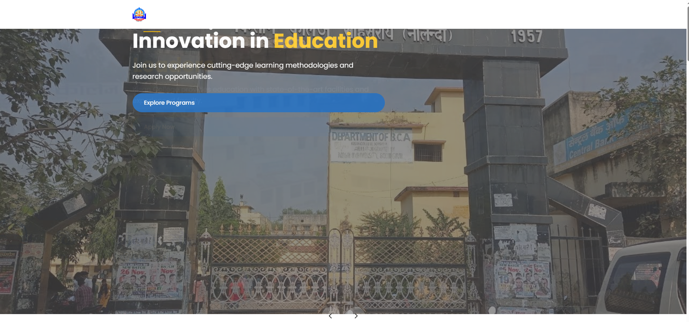

# Kisan College Website - Modern Design with Animations
 
Overview

A responsive, modern website for Kisan College featuring elegant animations and interactive elements. This single-page application showcases the college's programs, facilities, admission process, and contact information with smooth scrolling navigation and engaging visual effects.

Key Features
Fully Responsive Design: Adapts seamlessly to all device sizes

Interactive Animations:

Preloader animation

Animate On Scroll (AOS) effects

Hero image slider with auto-rotation

Hover animations for buttons and cards

Comprehensive Sections:

Hero banner with call-to-action

About the college with achievements

Programs offered with icons

Facilities showcase

Admissions process

Testimonials

Contact information with embedded map

User Experience Enhancements:

Mobile-friendly navigation

Back-to-top button

Form validation

Social media integration

Technologies Used
HTML5

CSS3 (Flexbox, Grid, animations)

JavaScript (ES6)

Font Awesome (Icons)

Google Fonts (Poppins font family)

AOS Library (Animate On Scroll)

Installation & Usage
Download the files:

Save the provided HTML file as index.html

Add your assets:

Place your logo as logo.png in the same directory

Add images for:

Hero slides (hero1.jpg, hero2.jpg)

About section (about.jpg)

Facilities (library.jpg, lab.jpg, sports.jpg)

Testimonials (student1.jpg, student2.jpg)

Customize content:

Edit the HTML to include your college's specific information

Update contact details, programs, and other content

Host the website:

Upload to your preferred web hosting service

The site works as a single static HTML file with all dependencies loaded via CDN

Customization Options
Color Scheme:
Modify the CSS variables in the :root selector to match your college's branding:

css
:root {
    --primary-color: #0056b3; /* Main brand color */
    --secondary-color: #f8f9fa; /* Light background color */
    --accent-color: #ffc107; /* Accent color for highlights */
    --text-color: #333; /* Main text color */
    --light-text: #777; /* Secondary text color */
}
Content Updates:

Edit text content directly in the HTML

Add/remove program cards as needed

Update the admission process steps

Animation Settings:
Adjust AOS initialization in the JavaScript section:

javascript
AOS.init({
    duration: 800, // Animation duration
    easing: 'ease-in-out', // Animation style
    once: true, // Whether animation happens once or every scroll
    offset: 100 // Offset (in px) from the original trigger point
});
Browser Support
The website is tested and works on:

Chrome (latest)

Firefox (latest)

Safari (latest)

Edge (latest)

Mobile browsers (Chrome, Safari)

Credits
Font Awesome for icons

Google Fonts for Poppins font

AOS Library for scroll animations

License
This project is open-source and available for educational purposes. For commercial use, please ensure you have the proper licenses for any included assets.
